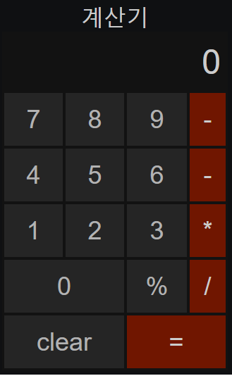

# **자바스크립트 실전 프로젝트북** 의 예제입니다. 
   

## <u>**작업순서**   </u>
>**1. HTML 과 CSS**   
**2. 주요 변수 선언**    
**3. 숫자 및 사칙 연산 버튼 처리**    
**4. 계산기 입력 처리**    
**5. 계산기 초기화 및 버튼 처리**   
**6. 계산 결과 및 버튼 처리**    
**7. 오류 처리(기능개선)**   


## <u>**사전학습 : form 요소**</u>
* 웹 브라우저에서 로그인하거나 회원가입을 하려면 다양한 정보를 입력받아야 한다. 
* 이러한 경우에는 form 요소로 정보를 입력받는다. 계산기에서 숫자를 입력받는 것도 마찬가지로 form 요소를 사용한다. 

```html
 <!--form 객체-->
 <!--form 객체 접근 방식은 크게 두 가지가 있다.-->
 <!--1) document.formName.typeName.속성(또는 메서드)-->
 <!--2) document.forms['formName']['typeName'].속성(또는 메서드)-->
 <!--      - 첫 번째 방식은 document 객체의 직계로 form 속성에   -->
 <!--      정의된 name의 값이 form 요소의 객체명이 되므로 이를 통해 -->
 <!--      접근하는 것이다. -->

    <!DOCTYPE html>
    <html lang="en">
        <head>
            <meta charset="UTF-8">
            <title>form 객체</title>

            <style>
                label {
                    float : left;
                    width : 80px;
                }
                input,label {
                    display : block;
                    margin-bottom : 10px;
                }
            </style>
        </head>
        <body>
            <form name="frm"> <!--formName-->
                <label for="myId">ID: </label>
                <input type="text" id="myId" name="myId" />
                <input for="pwd">password: </label>
                <input type="password" id="pwd" name="pwd" />

                <input type="button" name="send" value="로그인" /><!--typeName-->
            </form>

            <script>
                // form 객체의 name 값으로 접근한다. 
                var frm = document.frm;  // form 객체 지정 
                var myId = frm.myId;    // id 입력란(myId) 객체 지정 
                var pwd = frm.pwd;      // id 와 동일
                var send_btn = document.frm.send; // 전송 버튼 객체 지정 

                send_btn.onclick = function () {
                    var newId = myId.value,
                    newPwd = pwd.value;

                    // 빈 값 검사 
                    if(newId == '' || newPwd == '') {
                        alert('아이디 또는 비밀번호가 입력되지 않았습니다.');
                    } else {
                        alert(myId.value + '님 환영합니다');
                    }
                };
            </script>
        </body>
    </html>

    <!--두 번째 방식은 forms 라는 객체명을 통해 접근한다.-->
    <!--forms 객체의 배열 값에 form에서 지정한 name 속성의 값을 지정하면 -->
    <!--해당하는 form에 접근할 수 있다.-->
    <!DOCTYPE html>
    <html>
        <head>
            <meta charset="UTF-8">
            <title>form 객체</title>
        </head>
        <body>
            <form name="frm">
                <input type="text" name="text" />
                <input type="button" onclick="put_text()" value="click" />
            </form>
            <script>
                function put_text() {
                    // form 객체 내의 name = 'text' 인 입력 요소 지정 
                    var frm = document.forms['frm']['text'];

                    // 입력 요소에 값을 입력 
                    frm.value = '값을 입력';
                }
            </script>
        </body>
    </html>

```

## <u>**this 객체**</u>
- this 는 현재 호출한 객체를 의미하기 때문에 상황에 따라 달라진다. 
- 목록에서 사용자가 특정 목록을 클릭하는 경우를 살펴 보자. 
```html
    <!DOCTYPE html>
    <html>
        <head>
            <meta charset="UTF-8">
            <title>form 객체</title>
        </head>
        <body>
            <ul id='gnb'>
                <li>click</li>
                <li>seconds</li>
                <li>thirds</li>
            </ul>
            <script>
                // 문서 객체 선택
                var gnb = document.getElementById('gnb');
                var li = gnb.getELementsByTagName('li');

                // 첫 번째 목록 클릭 시 스타일 변경 
                li[0].onclick = function () {
                    li[0].style.backgroundColor = 'red';
                };
            </script>
        </body>
    </html>
```
- 이벤트 핸들러를 첫 번째 li 에 지정하고 해당하는 li 에 스타일을 지정한다. 하지만 함수 내에서 명시적으로 같은 객체명을 재징할 필요는 없다. this는 키워드를 사용하면 현재 이벤트 핸들러를 적용한 부모 객체를 의미하기 때문이다. 
```javascript
    // 코드를 다음과 같이 바꿔도 동작한다. 
    li[0].onclick = function () {
        this.style.backgroundColor = 'red';
    }
```
- 수정된 코드에서 this는 이벤트 핸들러에 지정한 li[0] 객체를 의미하며 상대적인 객체 지정 방식이다. 프로그램의 매커니즘 상 같은 문서 객체를 재지정하는 것은 성능 향상에 좋지 않다. 

&nbsp;

- - - -
&nbsp;

# **계산기 구현하기**
- 폼 요소를 이용하여 주요 버튼 영역과 출력 부분을 작성한다. 
```html
<!DOCTYPE html>
<html lang="en">
    <head>
        <meta charset="UTF-8">
        <title>계산기</title>

        <style>
            caption { font-size : 32px; }
            table { width : 320px; }
            table, th { background : #333; }
            th {
                padding-right : 10px;
                hegith : 80px;
            }
            td {
                height : 75px;
                text-align : center;
            }
            th > input {
                width : 100%:
                border : none;
                background : #333;
                color : white;
                text-align : right;
                font-size : 48px;
            }
            td > input[type="button"] {
                width : 100%;
                height : inherit;
                color : #333;
                font-size : 36px;
                border : none;
            }
            td > input[type="button"]:hover {
                background : #999;
            }
            td:last-child > input {
                background : orange; 
                color : white;
            }
        </style>
    </head>
    <body>
        <form name="cal">
            <table>
                <caption>계산기</caption>
                <tr><!--결과창-->
                    <th colspan="4"><input type="text" name="result" value="0"></th>
                </tr>
                <tr><!--숫자 입력 창-->
                    <td><input type="button" value="7"></td>
                    <td><input type="button" value="8"></td>
                    <td><input type="button" value="9"></td>
                    <td><input type="button" value="+"></td>
                </tr>
                <tr>
                    <td><input type="button" value="4"></td>
                    <td><input type="button" value="5"></td>
                    <td><input type="button" value="6"></td>
                    <td><input type="button" value="-"></td>
                </tr>
                <tr>
                    <td><input type="button" value="1"></td>
                    <td><input type="button" value="2"></td>
                    <td><input type="button" value="3"></td>
                    <td><input type="button" value="*"></td>
                </tr>
                <tr>
                    <td colspan="2"><input type="button" value="0"></td>
                    <td><input type="button" value="%"></td>
                    <td><input type="button" value="/"></td>
                </tr>
                <tr>
                    <td colspan="2"><input type="button" class="cls_btn" value="clear"></td>
                    <td colspan="2"><input type="button" class="result_btn" value="="></td>
                </tr>
            </table>
        </form>
        <script>
            // 변수 선언 
            var inp = document.forms['cal']; 
            var input = inp.getElementsByTagName('input');
            var cls_btn = document.getElementsByClassName('cls_btn')[0];
            var result_btn = document.getElementsByClassName('result_btn')[0];
        </script>
    </body>
</html>
```